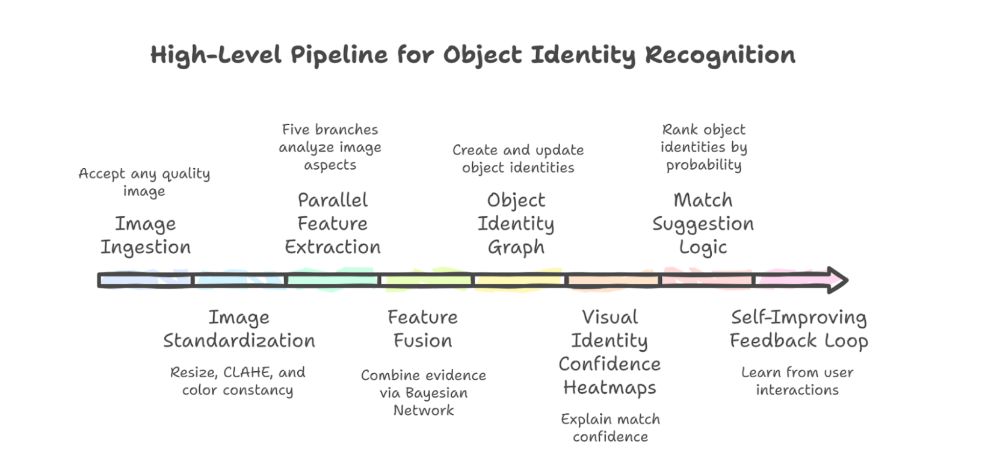
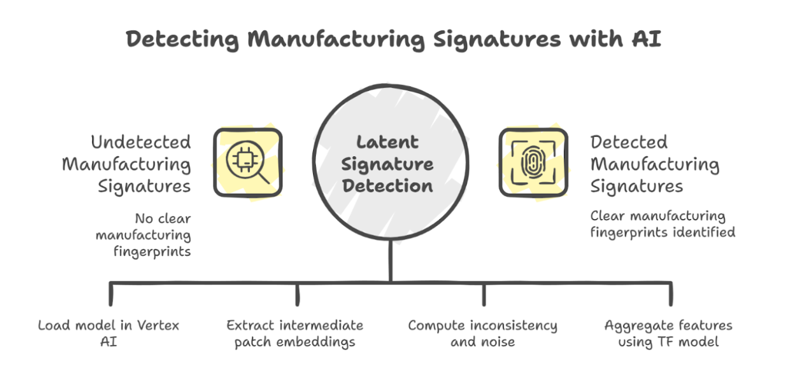
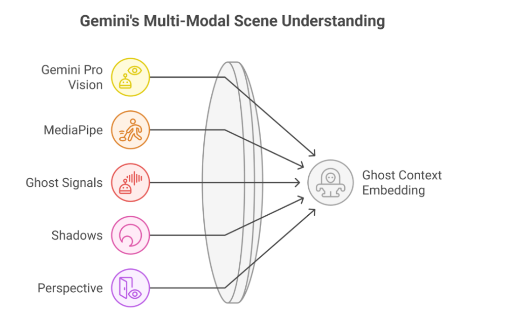
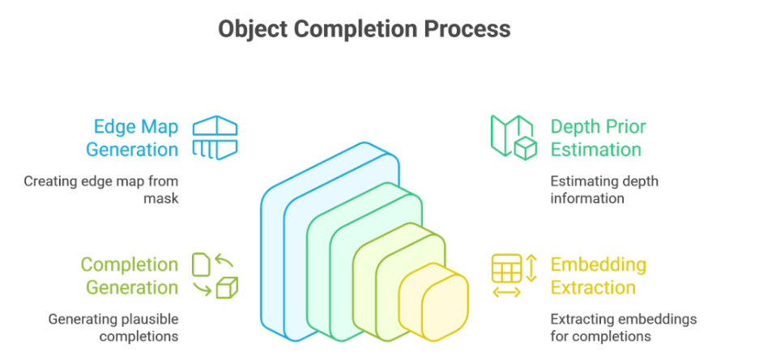
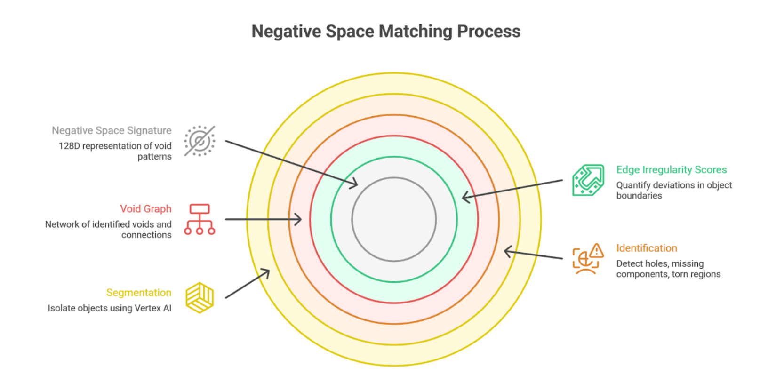
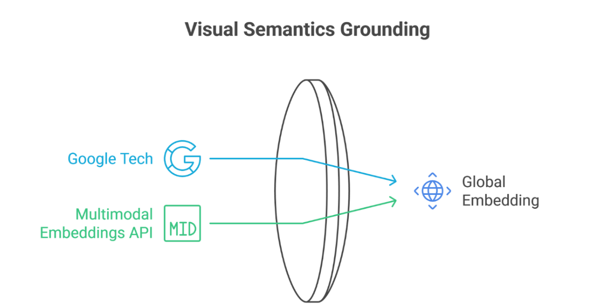
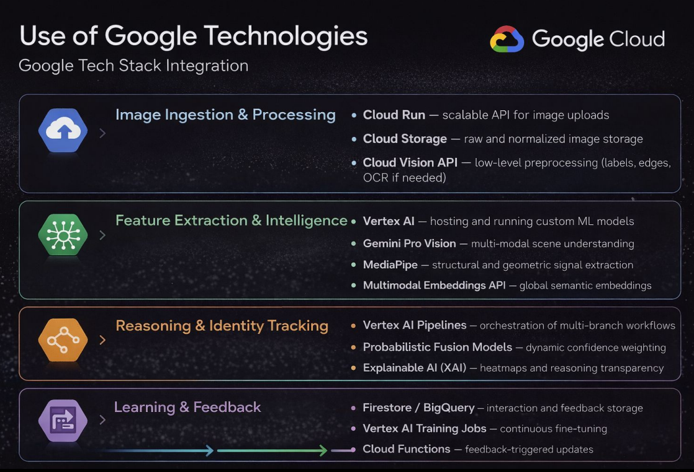

# Object Identity AI (GCP)
Multi-Branch Visual Fingerprinting & Probabilistic Matching System

A production-ready, multi-branch object identity system deployed on Google Cloud Platform.
The system ingests real-world images and reconstructs persistent object identity using complementary visual signals, uncertainty-aware evidence fusion, and explainable AI.

This is not image search.
This system reasons about physical object continuity over time.

## Core Capabilities

- Robust to angle, lighting, damage, occlusion, and partial views
- Tracks object identity evolution across sightings
- Probabilistic, uncertainty-aware matching
- Fully explainable results (heatmaps + natural language)
- Designed for Cloud Run + Vertex AI production deployment

## System Overview

> “We do not search images. We reconstruct physical object identity using multi-signal intelligence.”

  

### Visual Walkthrough (End‑to‑End Pipeline)

<em>From ingestion → identity reconstruction → ranking → explainability</em>

### Feature Branches

### Branch A — Manufacturing Signature
- ViT patch variance (latent manufacturing noise)
- CLIP image embeddings

### Branch B — Multi-Modal Ghost Matching
- Gemini Vision understanding
- MediaPipe geometry
- Custom ghost signals

### Branch C — Partial Object Completion
- Mask generation
- Edge & depth priors
- Imagen inpainting
- Completion embeddings

### Branch D — Negative-Space Matching
- Void signatures (128D)
- Structural absence reasoning

### Branch E — Visual Semantic Grounding
- Vertex AI Multimodal Embeddings

## Tech Stack

Runtime: FastAPI on Cloud Run  
Storage: GCS, Firestore  
AI/ML: Vertex AI (Gemini, Multimodal Embeddings, Imagen), MediaPipe, PyTorch, TFP

  

## API Endpoints and GCP Setup

GET /health  
POST /analyze  
POST /feedback  
Enable:
- Cloud Run
- Cloud Storage
- Firestore
- Vertex AI

## Deployment and Firestore Data Model

Use Cloud Run with environment variables for GCS, Gemini, Imagen, and embeddings.
objects/{object_id}  
sightings/{sighting_id}  
fusion/reliability  

## Performance Notes and Security

- CPU Cloud Run works; GPU optional
- 2–4Gi memory recommended
- Least-privilege IAM
- Signed URLs if private

## License

MIT or Apache-2.0
